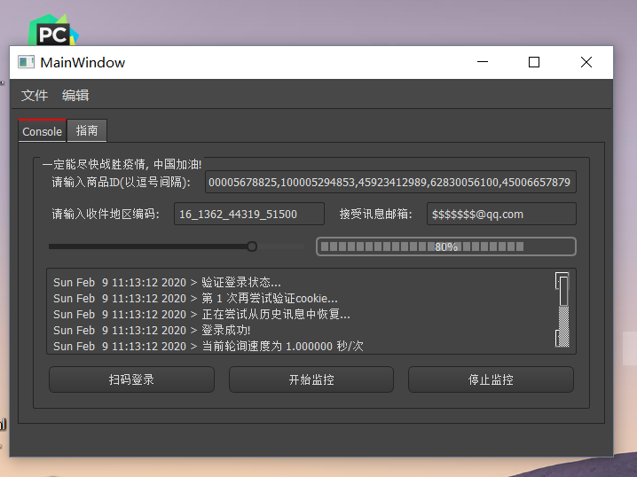

# auto-buy-Python-tool
 图形界面, 电脑小白也会用, 下载可直接运行! 京东自动购买口罩 实时抢购口罩 工具, 抗击疫情 中国加油!

<a href="https://github.com/ZhangYikaii/auto-buy-Python-tool/releases">点击这里</a> 下载`JDAutoBuy-release.zip`, 解压后可**直接运行!**


## 使用指南

运行界面**如下图**:



### 填写方式:

+ **输入商品ID:** 比如`URL`为: https://item.jd.com/1835967.html 的商品ID为**1835967**.
+ **输入收件地区编码**: 登录京东并访问商品页, 选择派送地址后查找**stock?**开头的URL讯息, 如下图: 
+ **接受讯息邮箱**: 您的接受讯息邮箱.

以下选项您可以不看也会使用:

**扫码登录**: 如果京东手机客户端无法扫码, 请用**微信**扫一扫试一下.

**开始监控**: 如果**未登录点击此按钮**, 您之前登录成功过则会读取历史登录记录尝试登录, 否则会提示您先扫码登录.

**滑动条**: 控制监控时查询的速度(频率).

---

## 以下是控制台版本程序的说明, 如果您使用图形界面版本, 可以不看

**获取登录*cookie***: Chrome 登录京东后`F12`, 如下图.


**获取商品URL**: 登录并访问商品页, 选择派送地址后查找**stock?**开头的URL讯息, 如下图.


请注意商品`URL`需要是您的地址编号, 如TXT文件中`area=`参数.


**以上两步**获得的讯息填入`Please fill out this document.txt`文件.

```shell
pip install -r requirements.txt
python JDAutoBuyTool.py
```


**运行环境**:

`Windows 10, Python 3`

**运行示例**:


---

感谢[cycz](https://github.com/cycz)大佬, 参考了部分代码.

心情复杂, 也不懂抢口罩工具能不能帮上忙, **一定能尽快战胜疫情! 中国加油!** :star2: