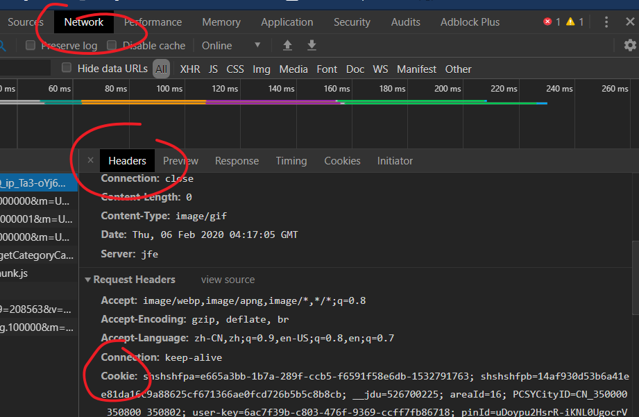
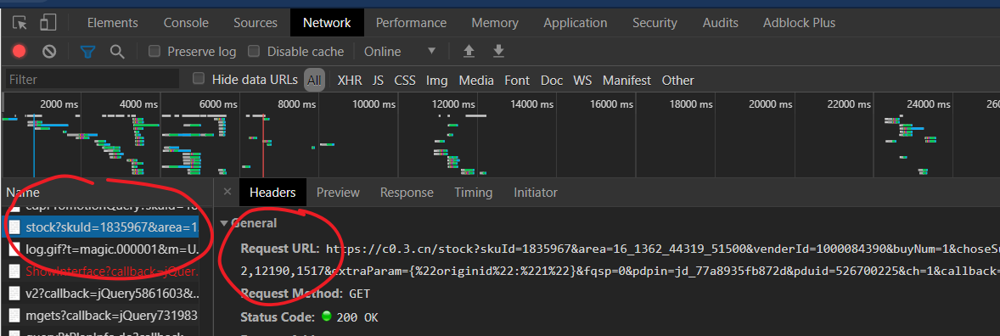
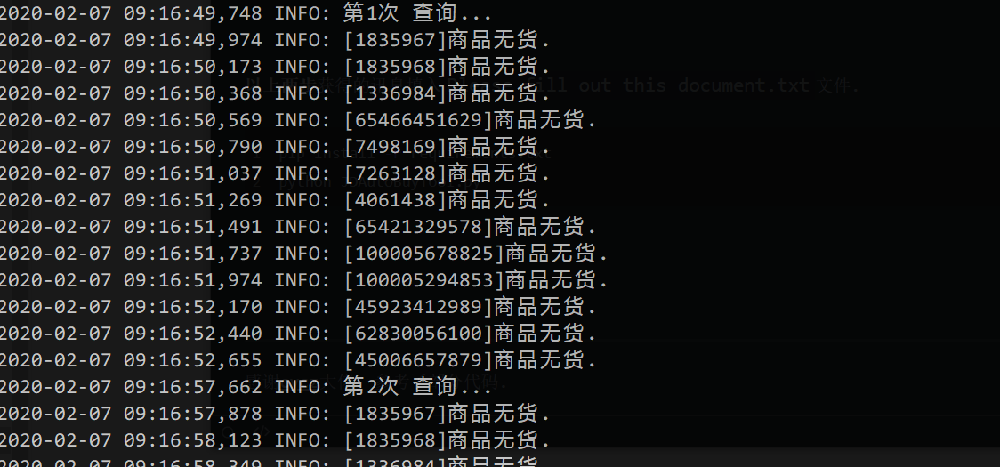

# auto-buy-Python-tool
 京东自动购买口罩 实时抢购口罩 Python工具, 抗击疫情 中国加油


## 使用指南

**获取登录*cookie***: Chrome 登录京东后`F12`, 如下图.




**获取商品URL**: 登录并访问商品页, 选择派送地址后查找**stock?**开头的URL讯息, 如下图.



请注意商品`URL`需要是您的地址编号, 如TXT文件中`area=`参数.


**以上两步**获得的讯息填入`Please fill out this document.txt`文件.

```shell
pip install -r requirements.txt
python JDAutoBuyTool.py
```


**运行环境**:

`Windows 10, Python 3`

**运行示例**:



---

感谢[cycz](https://github.com/cycz)大佬, 参考了部分代码.

心情复杂, 也不懂抢口罩工具能不能帮上忙, **一定能尽快战胜疫情! 中国加油!** :star2: